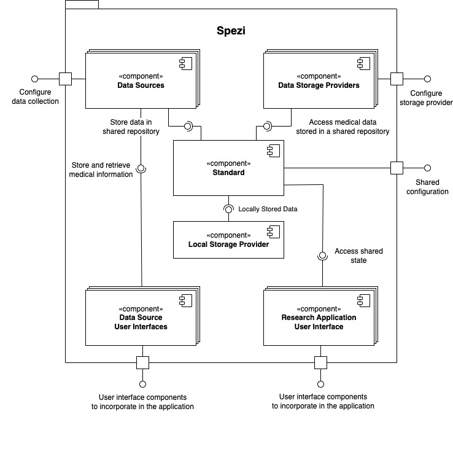

<!--

This source file is part of the Stanford Spezi open-source project.

SPDX-FileCopyrightText: 2022 Stanford University and the project authors (see CONTRIBUTORS.md)

SPDX-License-Identifier: MIT
  
-->

# Spezi

An open-source framework for the rapid development of modern, interoperable digital health applications.

For more information, please refer to the [API documentation](https://swiftpackageindex.com/StanfordSpezi/Spezi/documentation).

## The Spezi Architecture

Spezi introduces a standards-based modular approach to building digital health applications. A standard builds the shared repository of data mapped to a common understanding that is used to exchange data between Spezi modules.

We differentiate between five different types of modules:
- **Standard**: Acts as a shared repository and common ground of communication between modules. We, e.g., provide the FHIR standard as a great standard to build your digital health applications.
- **Data Sources**: Provide input to a standard and utilize the standard's data source registration functionality and adapters to transform data into the standardized format. Examples include the HealthKit data source.
- **Data Source User Interfaces**: Data source user interfaces are data sources that also present user interface components. This, e.g., includes the questionnaire module in the Spezi Swift Package.
- **Data Storage Providers**: Data storage providers obtain elements from a standard and persistently store them. Examples include uploading the data to a cloud storage provider such as the Firebase module.
- **Research Application User Interface**: Research application user interfaces display additional context in the application and include the onboarding, consent, and contacts modules to display great digital health applications.

The [API documentation](https://swiftpackageindex.com/StanfordSpezi/Spezi/documentation) includes a selector to switch between the different Swift Package Manager Targets, allowing you to explore the different modules that are included in the Spezi repository.

## The Spezi Template Application

The [Spezi Template Application](https://github.com/StanfordSpezi/SpeziTemplateApplication) provides a great starting point and example about using the different Spezi modules.

## Contributing

Contributions to this project are welcome. Please make sure to read the [contribution guidelines](https://github.com/StanfordSpezi/.github/blob/main/CONTRIBUTING.md) and the [contributor covenant code of conduct](https://github.com/StanfordSpezi/.github/blob/main/CODE_OF_CONDUCT.md) first.

## License

This project is licensed under the MIT License. See [Licenses](https://github.com/StanfordSpezi/Spezi/tree/main/LICENSES) for more information.

