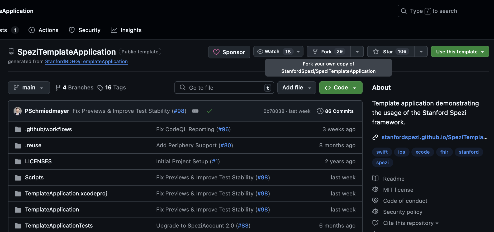

# Spezi Starter Guide

<!--
This source file is part of the Stanford Spezi open-source project
SPDX-FileCopyrightText: 2024 Stanford University and the project authors (see CONTRIBUTORS.md)
SPDX-License-Identifier: MIT
-->

## Introduction
This guide is designed to assist newcomers and potential contributors in navigating the Spezi open-source project. It serves as an initial point of reference, providing an overview and links to helpful documents, as well as tips on how and where to start.

## A Three-Step Spezi Starter Guide
Below are three fundamental steps we recommend to familiarize yourself with the Spezi ecosystem. These are designed to provide a structured way of understanding Spezi.

### First Step: Introducing Spezi
In this section, we introduce the initial steps to get acquainted with Spezi. Understanding Spezi as a project and the topics it covers is crucial. Here are some resources to help you get started:

1. The **[Spezi Website](#https://spezi.stanford.edu/)** offers an excellent introduction to the project and explains the goals of the open-source initiative.

2. The **[Spezi Notion Page](https://www.notion.so/Research-Opportunities-8ff2893741164e3b9b99ee4da8d992a3?pvs=4)** is a great resource to view current project topics and read guidelines for research collaboration.

3. The **[Spezi Ecosystem Page](#spezi-ecosystem)** provides a comprehensive overview of the modules and their use cases.

### Second Step: Trying out the Spezi Template Application
Once you have a basic understanding of Spezi, it's beneficial to test the framework on your own machine using the template application. This is how: 

1. Access the **[Template Application(#https://github.com/StanfordSpezi/SpeziTemplateApplication)]** here.

2. Continue with the **Setup Instructions**:
   - Start by **forking the repository**.
   @Row{
      @Column {
         
      }
   }
   
   - Use the terminal on your Mac to **clone the forked repository locally**. Navigate to the directory where you want to store the template application.
   - Follow the setup and run instructions provided here: [Setup Guide](https://spezi.health/SpeziTemplateApplication/documentation/templateapplication/setup)

> **Note**: You may need to update packages. 
// tbd: screenshots hinzufügen

### Third Step: Independent Exploration
- **Self-Directed Tasks**: Refer to the tasks section for guidance on independent exploration.
- **Team Collaboration**: If interested, feel free to reach out to the team to discuss any questions or ideas.

## Additional Resources
Here is a collection of further links and a brief description of their use cases, if not already covered above:

- **Spezi Ecosystem Documentation**
- **Documentation Guide**
- **Contribution Guide**
- **Initial Setup Instructions**
